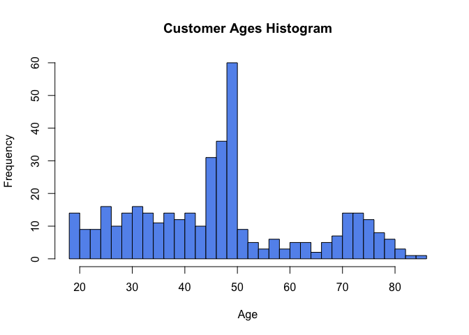

Computational Statistics in Business Analytics - Introduction to
Computation
================

**Author:** Daniele Melotti<br> **Date:** Nov 2023

*See README for info about data and list of tasks*.

# 1. Retrieve Data Points

We import a dataset containing 1 variable, which is the age of a set of
customers, and move the ages into a vector called *ages*.

``` r
dataset <- read.table(file = "../data/customers.txt", header = TRUE, colClasses = "numeric")
ages <- dataset$age
```

Then, we want to determine how many customers (or ages of customers) are
present within our data.

``` r
length(ages)
```

    ## [1] 399

Now we know that there are *399* customers in total. Next, we check what
is the age of certain elements of the vector; for instance, the 1st, 5th
and 100th element of *ages*.

``` r
ages[c(1, 5, 100)]
```

    ## [1] 49 45 34

We see that the the 1st, 5th and 100th are *49*, *45*, and *34* years
old respectively. Now, we are interested in finding the age of the
youngest and oldest customer.

``` r
min(ages)
```

    ## [1] 18

``` r
max(ages)
```

    ## [1] 85

We can see that the youngest and oldest customers present in the dataset
are aged *18* and *85* respectively.

# 2. Sorting and High-Level Analysis

We sort the ages into ascending order. We can take a peek into the five
lowest ages:

``` r
sorted_ages <- sort(ages)
sorted_ages[1:5]
```

    ## [1] 18 19 19 19 19

As we can see, there is only one customer aged 18, while there are at
least four customers aged 19. If we were interested in seeing uniquely
the 5 smallest ages without seeing how many customers have said ages, we
could do it in the following way:

``` r
head(unique(sorted_ages), n = 5)
```

    ## [1] 18 19 20 21 22

Hence, we know that the 5 smallest ages are *18*, *19*, *20*, *21* and
*22*. We repeat the process for the 5 highest ages:

``` r
tail(unique(sorted_ages), n = 5)
```

    ## [1] 80 81 82 83 85

Next, we compute a statistic of central tendency, the mean:

``` r
mean(ages)
```

    ## [1] 46.80702

The average age of the customers is *46.807*, close to 47. As for the
standard deviation:

``` r
sd(ages)
```

    ## [1] 16.3698

As we can see, the standard deviation is *16.3698*, which is roughly a
third of the mean.

# 3. Analysis of Differences

We compute the difference of each age value and the mean:

``` r
age_diff <- ages - mean(ages)
```

The values contained in *ages_diff* represents *deviation* from the
mean. Now, we compute the average of the differences above.

``` r
mean(age_diff)
```

    ## [1] -1.623275e-15

The result is a *zero*. Why is that? Usually, the mean of differences is
zero because in theory for every positive deviation, there is always a
corresponding negative deviation of equal magnitude. This is the reason
why we usually compute standard deviation, which is based on squared
differences from the mean rather than raw differences; squaring the
differences does two things: 1. It gets rid of negative signs. 2. It
gives more weight to larger differences.

# 4. Visualization

In order to get a better view of how the values of *ages* are
distributed, we can plot a histogram.

``` r
hist(ages, main = "Customer Ages Histogram", xlab = "Age", ylab = "Frequency", breaks = 35, col = "cornflowerblue")
```



The histogram allows us to see that there is a relatively large number
of customers aged between *48* and *50*. Generally, customers aged
between *44* and *50* are more largely present in the dataset compared
to other ages. We can also draw a density plot of *ages*:

``` r
plot(density(ages), main = "Customer Ages Histogram", xlab = "Age", ylab = "Density",
     col = "cornflowerblue", lwd = 2)
```


We can see that the shape of the density plot resembles the histogram.
Finally, we show a boxplot with a stripchart:

``` r
boxplot(ages, main = "Boxplot + Stripchart", horizontal = TRUE,
        xlab = "Age", ylab = "", col = "cornflowerblue")
stripchart(ages, method = "stack", add = TRUE, col = "darkblue", bg = "lightblue", at = 0.6)
```


The plot above clearly helps us to visualize plenty of information, such
as mean, outliers, data distribution, and more.

# Summary

This project is helpful in getting a gentle introduction to data
retrieval techniques, measures of central tendency such as the mean and
standard deviation, as well as on why we tend to use standard deviation
rather than raw deviations.

We analyzed a dataset of customer ages, which includes 399 data entries,
where the youngest customer is 18 and the older customer is 85 years
old. We found that the mean age is 46.807 and the standard deviation is
16.3698. When computing the average value of raw differences, we noticed
that said value was zero, making us point out that it is better to use
standard deviation as a measure of dispersion. Finally, we displayed a
histogram, a density plot, and a boxplot with stripchart, which are all
informative and allowed us to get a grasp of the shape of the data
distribution and other important statistics.
